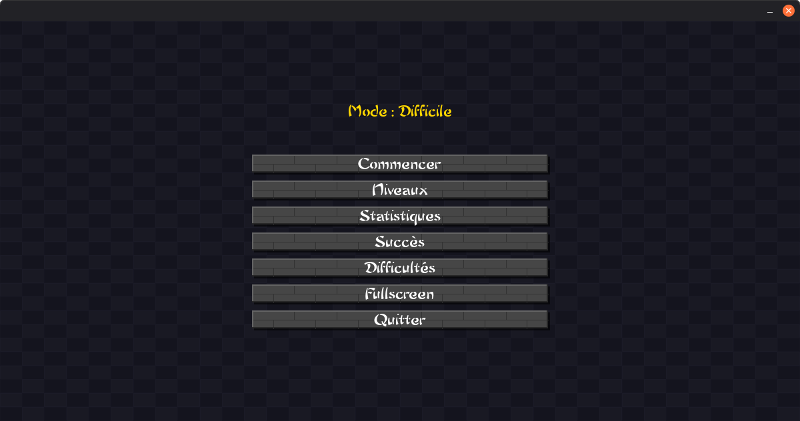
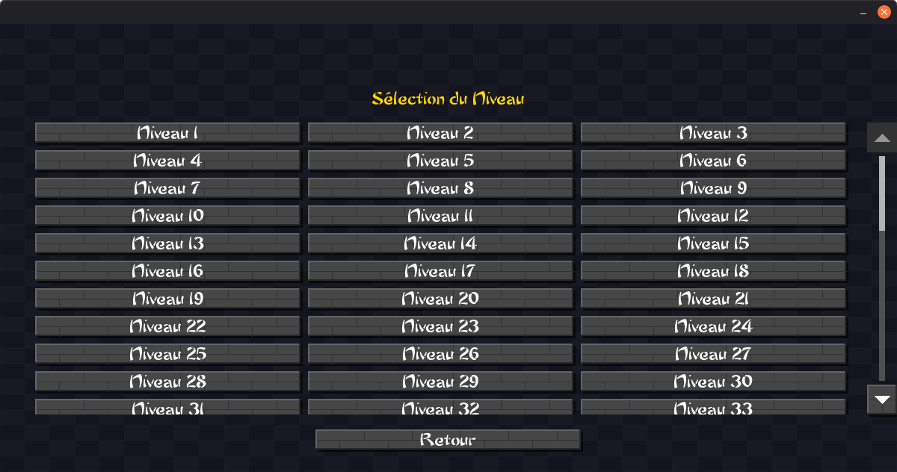
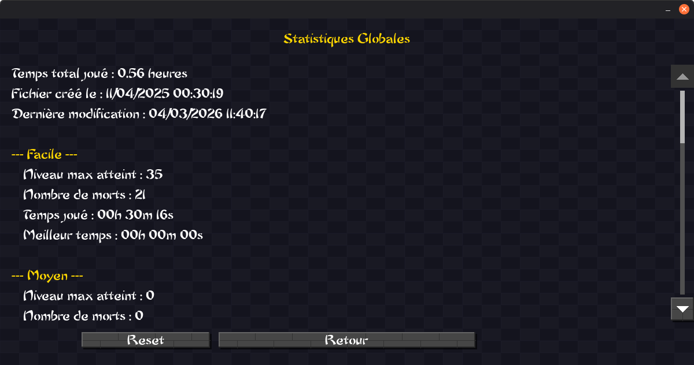
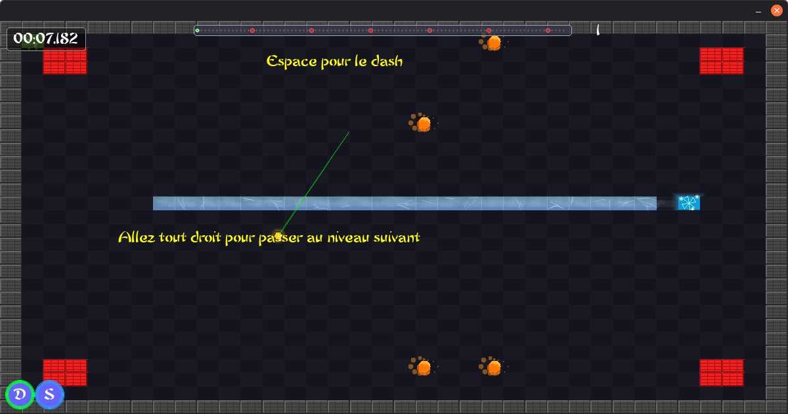
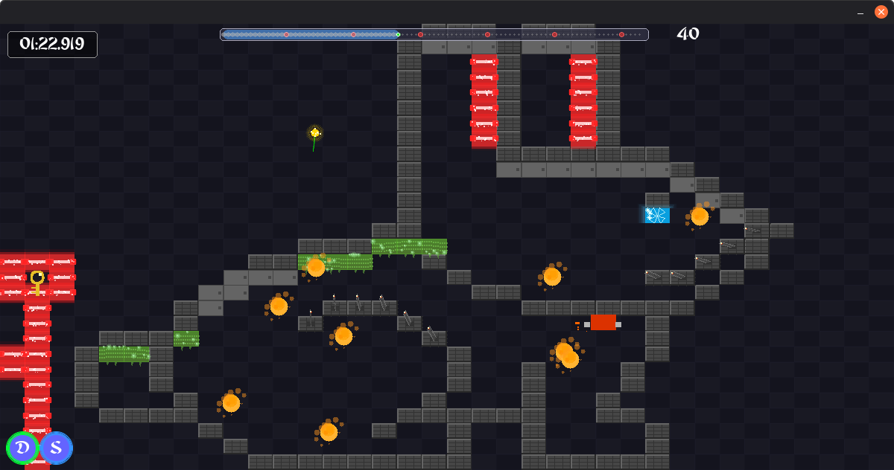

# Projet : Speedy (Jeu 2D "Die and Retry" en C)
> **Note :** Ce projet a été réalisé dans le cadre de ma Licence à l'université du Mans, au sein d'une équipe de 4 étudiants.

## 1. Le Concept

Speedy est un jeu de type "die and retry" où le joueur contrôle une boule qui doit traverser de nombreux niveaux remplis de pièges.

## 2. Technologies Utilisées

* **Langage :** C
* **Gestion de version :** Git (sur une instance GitLab universitaire)
* **Graphisme :** SDL2

## 3. Mon Rôle dans le Projet

Je me suis particulièrement concentré sur :

* La création des pièges et les collisions
* La structure des niveaux

## 4. Galerie

Menu Principal

Menu de sélection de niveaux

Menu de statistiques

Exemples de 2 niveaux parmi les 94

